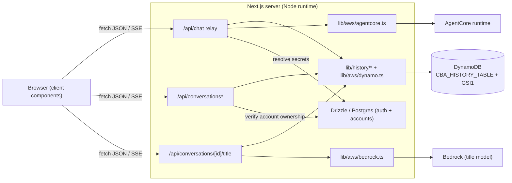

# Design Document

## Overview

Iteration 2 extends the existing Cloud Bill Analyst web app (`app/`, Next.js App
Router + TypeScript + pnpm) with four capabilities: persisted chat history in
DynamoDB, inline client-rendered charts driven by a new `chart` SSE event,
AI-generated + user-editable conversation titles, and a snappy optimistic
conversation sidebar. It builds directly on the iteration-1 primitives that are
already in place and does not recreate them:

- the pure SSE parser/redactor `lib/aws/sse.ts` (`parseSseChunk`,
  `toKnownEvent`, `redactForBrowser`),
- the pure stream reducer `streamReducer` and hook `useAgentStream` in
  `hooks/useAgentStream.ts`,
- the Node-runtime relay `app/api/chat/route.ts`,
- the server-only invocation module `lib/aws/agentcore.ts`,
- the deterministic session-id helper `lib/session-id.ts` (`sessionIdForThread`),
- the presentational chat components under `components/chat/`, and
- the guarded app shell `components/app-shell/sidebar.tsx`.

The central architectural change is the **chat-history data store move**: the
iteration-1 Postgres `threads`/`messages` tables are superseded by a **single
DynamoDB table** that stores conversations and their message transcripts
(including chart specs). Postgres/Drizzle retains **auth, sessions, and connected
accounts only**. This is greenfield — there is no thread/message data to migrate.

All AWS SDK access and all secret handling remain **server-side only**. Every new
route validates its inputs with **zod**, runs on the **Node runtime**, and passes
every browser-bound byte through the existing `redactForBrowser` step. Inline
charts are rendered entirely on the client from structured `spec` data — no image,
no S3, no presign.

### Design decisions and rationale

- **Persist server-side inside the relay, not the client.** The `/api/chat` relay
  already authenticates the user, narrows each SSE event with `toKnownEvent`, and
  redacts secrets. Making it the single writer of the transcript means the user
  message is persisted before invocation and the assistant message (text + charts
  + reports + activity) is persisted on stream completion, all under an
  ownership-authorized `userId` — no browser-trusted write path, and charts are
  persisted from the same narrowed events the browser renders. Assistant
  persistence runs in a `finally`/after-loop path **decoupled from the client
  connection**, so a turn whose browser navigated away (its `AbortController`
  cancelling the fetch) is still saved; only a turn aborted before any assistant
  text may be skipped. The title request is the one write the client fires (a
  background `POST`), because only the client knows the turn was the
  conversation's first — and it is fired only after the first user message is
  persisted so it never races that write.
- **Feedback is a DynamoDB attribute, not a table.** The iteration-1 Postgres
  `messageFeedback` table is dropped; thumbs-up/down is an optional `feedback`
  attribute on the Message_Item, written through one ownership-gated route/store
  path and hydrated back into the transcript — keeping all chat state (including
  feedback) in the single History_Table.
- **Deterministic session id from `conversationId`.** Iteration 1 generated a
  random `sessionId` at thread creation. Iteration 2 derives it with
  `sessionIdForThread(conversationId)` so the runtime session id is a pure
  function of the conversation id, stable across devices and reloads, and never
  stored as an independent source of truth that could drift.
- **Reuse the pure event pipeline for charts.** Adding `chart` to `SseEvent` +
  `toKnownEvent` (server) and a `charts` field to `streamReducer` (client) keeps
  the new event on the exact same validated, redacted, ordered path as `delta`,
  `tool`, and `report_file`. The client parser already trusts the server
  vocabulary, so no client-side narrower change is needed.
- **Title generation via Bedrock Converse, isolated from the agent.** Titles use
  `@aws-sdk/client-bedrock-runtime` (`ConverseCommand`) against
  `CBA_TITLE_MODEL_ID` — a fast/cheap model, completely separate from the
  AgentCore runtime — so a title never invokes the agent and never blocks a chat
  turn.

## Architecture

### Component map (iteration-2 targets in `app/`)

```
app/
  app/
    (app)/chat/[id]/page.tsx                     # conversation page (renamed param: conversationId)
    api/
      chat/route.ts                              # SSE relay — + chart forwarding + transcript persistence
      conversations/route.ts                     # GET list · POST create            (Node runtime)
      conversations/[id]/route.ts                # GET messages · PATCH rename · DELETE (Node runtime)
      conversations/[id]/title/route.ts          # POST AI title                      (Node runtime)
      conversations/[id]/messages/[messageId]/feedback/route.ts  # PATCH up/down feedback (Node runtime)
  components/
    chat/chart-inline.tsx                        # NEW client chart component (Recharts / shadcn Charts)
    chat/types.ts                                # + ChartSpec, extend ChatMessage with charts/reports
    app-shell/sidebar.tsx                        # optimistic New + inline rename + title skeleton
    app-shell/conversation-list.tsx              # NEW extracted client list (optimistic state)
  hooks/
    useAgentStream.ts                            # + charts field in StreamState + `chart` reducer case
    useConversations.ts                          # NEW client hook: list + optimistic create/rename/delete
  lib/
    aws/sse.ts                                   # + `chart` in SseEvent vocab + toKnownEvent narrowing
    aws/dynamo.ts                                # NEW server-only DynamoDBDocumentClient
    aws/bedrock.ts                               # NEW server-only title Converse call
    history/conversations.ts                     # NEW server-only conversation access patterns
    history/messages.ts                          # NEW server-only message access patterns
    history/keys.ts                              # NEW pure single-table key builders (client-safe, testable)
    title.ts                                     # NEW pure title normalization/fallback (client-safe, testable)
    db/schema.ts                                 # DROP threads/messages/messageFeedback defs; keep auth+accounts (Req 12.5, 12.6)
    db/migrations/                               # NEW drizzle-kit migration dropping the 3 chat tables
  ui/ chart.tsx                                  # shadcn `chart` primitive (pnpm dlx shadcn add chart)
```

`lib/actions/threads.ts` and the Postgres `threads`, `messages`, and
`messageFeedback` tables are removed for iteration 2; the new `lib/history/*` layer
plus the DynamoDB `feedback` attribute replace them, and a drizzle-kit migration
drops the three tables (Req 12.5).

### Data-store boundary



The browser never imports `lib/aws/*` or `lib/history/*`; it only calls route
handlers and renders `ChartInline` from already-redacted `spec` data.

### Request flows

**New conversation (optimistic).** The sidebar inserts a placeholder row, `POST
/api/conversations { accountId }` creates the item (rejecting when the user owns
no account), the client navigates to `/chat/<conversationId>` via the router (no
reload), reconciles the placeholder with the persisted row, and revalidates the
list. On failure it removes the placeholder and shows a toast.

**Chat turn + persistence.** `POST /api/chat { conversationId, prompt }` →
auth → load conversation from DynamoDB (ownership) for `accountId` + derived
`sessionId` → resolve account secrets from Postgres → **persist the user
message** → invoke the runtime → relay events (now including `chart`), accumulating
narrowed text/charts/reports/activity server-side → **persist the assistant
message on stream completion in a `finally`/after-loop path that is not gated on
the client connection** (so a navigated-away turn is still saved; a turn aborted
before any assistant text may be skipped). Only after the first user message is
persisted (e.g. after the first `delta`/on `done`), or by passing the first prompt
in the body, the client fires a background `POST /api/conversations/[id]/title` so
it never races the user-message write.

**Reopen.** `/chat/<id>` server component calls `GET /api/conversations/[id]`,
which authorizes ownership and returns messages oldest-first with their persisted
`ChartSpec`s; the page hydrates `ChatView`, which renders each persisted chart
with the same `ChartInline` used live.

## Components and Interfaces

### 1. SSE parser — add the `chart` event (`lib/aws/sse.ts`)

`SseEvent` gains a `chart` variant and `toKnownEvent` gains strict narrowing. The
module stays pure and client-safe (no `server-only`, no `@aws-sdk`).

```ts
export interface ChartSpec {
  id: string;
  chart_type: "bar" | "hbar" | "line" | "pie";
  title: string;
  currency: string;
  labels: string[];
  values: number[];
}

export type SseEvent =
  | { type: "delta"; text: string }
  | { type: "tool"; phase: "start"; id: string; name: string; label: string; status: string }
  | { type: "tool"; phase: "end"; id: string; name: string }
  | { type: "chart"; spec: ChartSpec }        // NEW (Req 2.1)
  | { type: "report_file"; key: string; bucket: string }
  | { type: "error"; message: string }
  | { type: "done" };
```

`toKnownEvent` adds a `case "chart"` that forwards only when `spec` is an object,
`chart_type ∈ {bar,hbar,line,pie}`, `labels` is a string array, `values` is a
number array, and `labels.length === values.length` (Req 2.2). Any other shape
returns `null` and is dropped (Req 2.3). Unknown top-level types keep being
dropped (Req 2.5). The relay already redacts and forwards in received order, so
Req 2.4 needs no relay change beyond the vocabulary.

### 2. Stream reducer — accumulate charts (`hooks/useAgentStream.ts`)

`StreamState` gains `charts: ChartSpec[]`; `createInitialStreamState` seeds it to
`[]`. A `case "chart"` appends `event.spec` immutably; `reset` clears it (via the
fresh initial state). All existing cases are unchanged, so the current property
tests keep passing (Req 3.4). The one-in-flight `send` guard is untouched
(Req 3.5). The client frame parser already forwards any record with a string
`type`, so `chart` events reach the reducer with no parser change.

```ts
export interface StreamState {
  assistantText: string;
  steps: ActivityStep[];
  charts: ChartSpec[];          // NEW (Req 3.1)
  reports: ResolvedReport[];
  phase: "idle" | "streaming" | "done" | "error";
  collapsed: boolean;
  errorMessage?: string;
  liveRegion: string;
}
// case "chart": return { ...s, charts: [...s.charts, event.spec] };  (Req 3.2)
```

**Client contract rename (`threadId` → `conversationId`, Req 3.6, 3.7).**
Iteration 1's `useAgentStream(threadId)` took a `threadId` parameter and POSTed
`{ threadId, prompt }`, but the iteration-2 `/api/chat` relay validates
`{ conversationId, prompt }`. To make both sides of `/api/chat` agree:

- the `useAgentStream` hook parameter is renamed `threadId` → `conversationId`;
- the request body it sends to the Chat_Relay becomes `{ conversationId, prompt }`
  (Req 3.6);
- every caller of `useAgentStream` (the `chat/[id]` page and any composer wiring)
  is updated to pass a `conversationId` argument;
- the `/api/chat` relay zod-validates the body as
  `{ conversationId: string, prompt: string }` and rejects with a typed error
  (without invoking the AgentCore runtime) when either field is missing (Req 3.7).

With the rename, the field names produced by `useAgentStream` match the field
names the Chat_Relay expects, so the chat POST passes zod validation.

### 3. Inline chart component (`components/chat/chart-inline.tsx`)

A client component (`"use client"`) that renders one `ChartSpec` with shadcn
Charts (Recharts, Base UI variant) inside a framed `Card` captioned with `title`.
It imports no server-only module (Req 13.3).

- Transforms the spec into rows by pairing `labels[i]` with `values[i]` into
  `{ name, value }` for every index (Req 4.4).
- Maps `chart_type`: `bar` → vertical bar, `hbar` → horizontal bar (Recharts
  `layout="vertical"`), `line` → line/area, `pie` → donut (`Pie` with
  `innerRadius`) (Req 4.3).
- Formats axis ticks + tooltip values with `currency` via `Intl.NumberFormat`
  (Req 4.5).
- Preset theme: violet data series (`--primary`/`--chart-1`), serif caption, sharp
  corners, no gradient fills (Req 4.6); responsive via `ChartContainer` /
  `ResponsiveContainer` with interactive tooltips (Req 4.7).
- Empty `labels` → an empty-state placeholder inside the card, no chart, no throw
  (Req 4.8); a single label/value pair renders one data point (Req 4.9).

`ChartView`/`MessageList` render one `ChartInline` per spec, in order, both for
the in-progress turn (`state.charts`) and for persisted turns (Req 4.1, 4.10). The
`AssistantTurn` and persisted-assistant branches in `message-list.tsx` gain a
charts slot rendered under the markdown content.

```ts
export interface ChartInlineProps { spec: ChartSpec }
export function ChartInline({ spec }: ChartInlineProps): JSX.Element;
```

### 4. DynamoDB document client (`lib/aws/dynamo.ts`)

Server-only (`import "server-only"`). Lazily constructs a `DynamoDBDocumentClient`
(`@aws-sdk/lib-dynamodb`) over `DynamoDBClient` (`@aws-sdk/client-dynamodb`) with
`AWS_REGION`, and exposes the resolved table name.

```ts
import "server-only";
export function getDocClient(): DynamoDBDocumentClient;   // memoized
export function historyTableName(): string;               // throws MissingHistoryConfigError if unset/empty (Req 12.3)
export class MissingHistoryConfigError extends Error {}   // names CBA_HISTORY_TABLE only, no value
```

`historyTableName` reads `process.env.CBA_HISTORY_TABLE` at call time; a
missing/empty value throws before any DynamoDB call is attempted (Req 12.3). This
is deliberately separate from `lib/env.ts`’s required-set check so the app does not
hard-fail globally on this one variable.

### 5. Single-table key builders (`lib/history/keys.ts`)

Pure, dependency-free, client-safe helpers (unit + property tested) that centralize
every key string so the access patterns and tests share one source of truth.

```ts
export const userPk       = (userId: string) => `USER#${userId}`;
export const convSk       = (conversationId: string) => `CONV#${conversationId}`;
export const convPk       = (conversationId: string) => `CONV#${conversationId}`;
export const gsi1Sk       = (updatedAtIso: string) => `TS#${updatedAtIso}`;
export const msgSk        = (createdAtIso: string, ulid: string) => `MSG#${createdAtIso}#${ulid}`;
export const MSG_PREFIX   = "MSG#";
```

### 6. Conversation store (`lib/history/conversations.ts`)

Server-only. Owns conversation-item access patterns; derives `userId` from the
session (never from the browser, Req 7.1) and derives `sessionId` via
`sessionIdForThread(conversationId)` (Req 5.4, 8.7).

```ts
export interface ConversationRecord {
  conversationId: string;
  title: string;
  titleSource: "pending" | "ai" | "user";
  accountId: string;
  sessionId: string;
  createdAt: string;
  updatedAt: string;
  messageCount: number;
}

createConversation(userId, accountId): Promise<ConversationRecord>;  // titleSource "pending" (Req 8.1)
listConversations(userId): Promise<ConversationRecord[]>;            // GSI1, ScanIndexForward=false (Req 6.1)
getConversationOwned(userId, conversationId): Promise<ConversationRecord | null>; // ownership gate (Req 6.2, 7.3)
renameConversation(userId, conversationId, title, source: "ai" | "user"): Promise<void>; // (Req 6.5, 8.5)
touchUpdatedAt(userId, conversationId, iso): Promise<void>;          // updates updatedAt + GSI1SK (Req 6.4)
deleteConversation(userId, conversationId): Promise<void>;           // item + messages (Req 6.6)
```

Items carry `PK`, `SK`, `GSI1PK`, `GSI1SK` plus the record attributes (Req 5.2,
5.3). `role_arn`/`external_id`/credentials are never written (Req 5.7, 13.6).

### 7. Message store (`lib/history/messages.ts`)

Server-only.

```ts
export interface MessageRecord {
  userId: string;
  role: "user" | "assistant";
  content: string;
  charts: ChartSpec[];
  reports: { key: string }[];
  activity?: { label: string; status: string }[];
  feedback?: "up" | "down";     // optional thumbs-up/down; absent when unset (Req 5.6, 14.1)
  createdAt: string;
}

appendMessage(userId, conversationId, msg): Promise<void>;   // put MSG item + messageCount++ + touch updatedAt (Req 6.3)
listMessages(userId, conversationId): Promise<MessageRecord[]>; // ownership gate then query MSG#, ascending (Req 6.2, 6.7)
setMessageFeedback(userId, conversationId, messageSk, feedback): Promise<void>; // ownership-gated UpdateItem of `feedback` (Req 14.2, 14.3)
```

`setMessageFeedback` is the single write path for Message_Feedback. It authorizes
ownership first — `getConversationOwned(userId, conversationId)` must return the
conversation item under `PK = "USER#<userId>"` — and only then issues an
`UpdateItem` on the Message_Item (`PK = "CONV#<conversationId>"`, `SK =
<messageSk>`) that sets the `feedback` attribute to `up` or `down` (Req 14.2). The
target message is addressed by its full message sort key (`MSG#<createdAtISO>#<ulid>`,
the persisted `createdAt`-derived id returned with each `MessageRecord`), so the
client passes back the same `SK` it hydrated rather than an ambiguous index. When
the caller lacks a valid session or does not own the conversation, no `UpdateItem`
is issued (Req 14.3). Feedback is written **only** here in DynamoDB — never to the
retired Postgres `messageFeedback` table (Req 14.5).

`appendMessage` writes the message item (`PK=CONV#…`, `SK=MSG#<iso>#<ulid>`) and,
in the same logical operation, increments `messageCount` and sets `updatedAt` +
`GSI1SK` on the conversation item (Req 6.3, 6.4). It stamps `userId` from the
authenticated session and writes only under a conversation the user owns (Req 7.4).
A small monotonic ULID/`randomUUID` suffix disambiguates same-millisecond writes so
`createdAt`-ascending ordering is stable (Req 6.7).

### 8. Conversations API (`app/api/conversations/route.ts`, `[id]/route.ts`)

All handlers `export const runtime = "nodejs"` (Req 7.6), derive `userId` from
`auth()` (401 when absent, Req 7.2), and validate inputs with zod before any
DynamoDB access (Req 7.5).

| Route | Method | Behavior | Requirements |
|---|---|---|---|
| `/api/conversations` | `GET` | list user's conversations, most-recent-updated first | 6.1, 8.3 |
| `/api/conversations` | `POST` | `{ accountId }`; verify account ownership in Postgres, create conversation (`titleSource:"pending"`), return `conversationId`; reject when zero/owned-not accounts | 8.1, 8.2 |
| `/api/conversations/[id]` | `GET` | ownership-gated messages oldest-first incl. charts | 8.4, 6.2, 6.7 |
| `/api/conversations/[id]` | `PATCH` | `{ title }`; rename + `titleSource:"user"` | 8.5, 11.2 |
| `/api/conversations/[id]` | `DELETE` | delete conversation + messages | 8.6, 6.6 |

A request for a conversation whose item does not exist under the user's `PK`
returns 404 and leaks no attribute, `sessionId`, or message (Req 7.3, 8.x).

### 9. Chat relay changes (`app/api/chat/route.ts`)

The body schema becomes `{ conversationId, prompt }`. The relay:

1. loads the conversation from DynamoDB with an ownership gate (replaces the
   Postgres `threads` lookup) to obtain `accountId` and derives
   `sessionId = sessionIdForThread(conversationId)` (Req 8.7);
2. resolves the pinned account's `role_arn` + decrypted `external_id` from
   Postgres (unchanged secret path);
3. **persists the user message** via `appendMessage` before invoking (Req 9.1);
4. relays events, now forwarding narrowed `chart` events in order (Req 2.4) and
   **accumulating** assistant `delta` text, `chart` specs, `report_file` keys, and
   `tool` steps into server-side locals as the SSE_Events arrive;
5. **persists the assistant message on stream completion in a code path that is
   NOT gated on the client connection** (Req 9.2). The accumulation loop is wrapped
   so that assistant persistence runs in a `finally` block (or an equivalent
   after-the-loop step) that executes even when the browser `fetch` is cancelled by
   its `AbortController` — i.e. the user navigated away or the chat component
   unmounted mid-turn. The persisted assistant Message_Item carries the final
   assistant text, the charts collected during the turn, the report keys collected
   during the turn, and an activity summary derived from the turn's steps, all
   redaction-passed (Req 9.3, 13.6).

**Disconnect-safe accumulation (Req 9.2, 9.7).** Because accumulation is
server-side and persistence is decoupled from the client connection, a turn whose
client disconnected is still saved. The one caveat: only turns that produced
assistant text are persisted — the `finally`/completion path checks the
accumulated text and, if a turn was aborted before any assistant `delta` arrived
(empty accumulated text), it MAY skip writing an assistant Message_Item for that
turn (Req 9.7), avoiding empty rows. The user Message_Item persisted in step 3 is
unaffected either way.

Pre-invoke rejections still return JSON without opening the stream; the single
redacted `error` event behavior is unchanged.

### 10. Title service (`lib/aws/bedrock.ts` + `app/api/conversations/[id]/title/route.ts`)

`lib/aws/bedrock.ts` is server-only and calls Bedrock Converse.

```ts
import "server-only";
export async function generateTitle(firstPrompt: string): Promise<string>;
// ConverseCommand against process.env.CBA_TITLE_MODEL_ID (Req 10.3);
// throws when the model id is unset/empty or the call fails (Req 12.4)
```

`lib/title.ts` is pure/client-safe and holds normalization + fallback:

```ts
export function normalizeTitle(raw: string): string;      // strip quotes + trailing punctuation, ≤ 6 words (Req 10.3)
export function fallbackTitle(firstPrompt: string): string; // ≤ 6 words from the prompt (Req 10.7)
```

`POST /api/conversations/[id]/title` (Node runtime, ownership-gated, zod-validated):

- loads the conversation; if `titleSource !== "pending"` it makes no change and
  returns success without invoking the model (Req 10.4);
- otherwise reads the first user message, calls `generateTitle`, and on success
  persists `normalizeTitle(...)` with `titleSource:"ai"` (Req 10.5);
- on failure retries exactly once (Req 10.6); if it still fails (including a
  missing `CBA_TITLE_MODEL_ID`, Req 12.4), persists `fallbackTitle(firstPrompt)`
  with `titleSource:"ai"` so the conversation is never left `pending` (Req 10.7).
  It never invokes the AgentCore runtime (Req 10.9).

The client fires this once in the background after the first user message
(Req 10.2). Because the Title_Service reads the first user message back from the
History_Table, the client must not let the title request race ahead of the
user-message write. It therefore fires `POST /api/conversations/[id]/title` **only
after the first user Message_Item is persisted** — e.g. after the first `delta`
event (by which point the relay has already written the user message in step 3 of
§9) or on the `done` event — **or** it includes the first user prompt in the title
request body so the service can title from the request payload without depending
on the persisted read. Either way the request never observes a conversation whose
first user message has not yet landed. The client also re-fires the request when
opening or listing a conversation that is still `pending` with `messageCount ≥ 1`
(Req 10.8), a safety net against a lost request.

### 11. Optimistic sidebar (`components/app-shell/conversation-list.tsx`, `hooks/useConversations.ts`)

The conversation list is extracted from `sidebar.tsx` into a client component
backed by `useConversations`, which holds the list plus optimistic operations:

- **create**: insert a placeholder row at the top before the request settles
  (Req 1.1), guard against a second in-flight create (Req 1.3), on success
  navigate + reconcile the placeholder into exactly one persisted row (Req 1.4,
  1.5), on failure remove the placeholder + toast + leave the rest unchanged
  (Req 1.6), and always revalidate on settle and return "New" to idle within
  200 ms (Req 1.2, 1.7). Zero accounts → disabled "New" + connect affordance
  (Req 1.8).
- **rename**: inline editable field pre-filled + focused, max 100 chars (Req 11.1);
  Enter with non-empty trimmed title → `PATCH` + `titleSource:"user"` (Req 11.2);
  Escape discards (Req 11.3); empty-after-trim discards and sends nothing
  (Req 11.6); success updates the row without reload (Req 11.4); failure restores
  the old title + toast (Req 11.7).
- **titles**: a row with `titleSource:"pending"` shows a skeleton shimmer instead
  of a title (Req 10.1); an AI/user title displays without reload (Req 10.5).

Editorial styling keeps the preset's flat rows with a violet active-state
left-border.

### 12. Message feedback (`app/api/conversations/[id]/messages/[messageId]/feedback/route.ts`, feedback UI)

Iteration 1's thumbs-up/down flow wrote to a Postgres `messageFeedback` table;
iteration 2 retires it and persists feedback as the optional `feedback` attribute
on the DynamoDB Message_Item (Req 14.1, 14.5). The write goes through one
ownership-gated server path.

- **Route (Node runtime, zod-validated, ownership-gated).** `PATCH`/`POST`
  `/api/conversations/[id]/messages/[messageId]/feedback` derives `userId` from
  `auth()` (401 when absent, Req 14.3), validates `{ feedback: "up" | "down" }`
  with zod before any DynamoDB access, and calls
  `setMessageFeedback(userId, conversationId, messageSk, feedback)`. The `messageId`
  path segment is the Message_Item's sort key id (its `createdAt`-derived
  `MSG#…#<ulid>` id) so the update targets exactly the addressed message. A request
  from a user who does not own the conversation resolves to 404 and writes nothing
  (Req 14.3). The zod enum constrains the persisted value to `up`/`down`.
- **Client feedback UI (Req 14.2, 14.4).** The 👍/👎 controls under an assistant
  turn (the message-actions row from the design system) write through this route —
  never to Postgres and never directly to DynamoDB. On hydrate, each assistant
  turn's feedback state is initialized from the persisted `feedback` value carried
  on its `ChatMessage` (Req 14.4): `up`/`down` shows the corresponding control as
  active, absent shows the neutral state. A successful submit optimistically
  reflects the chosen state and reconciles on response.

The feedback route reuses the same ownership gate and secret-exclusion guarantees
as the rest of the Conversations_Api; no `role_arn`/`external_id`/credential value
is involved in a feedback item.

## Data Models

### DynamoDB single-table layout (`CBA_HISTORY_TABLE`)

Provisioned out-of-band with a `GSI1` index; the app only reads/writes items.

**Conversation item** (Req 5.2, 5.3):

| Attribute | Example | Notes |
|---|---|---|
| `PK` | `USER#u_123` | ownership partition (Req 5.2) |
| `SK` | `CONV#c_abc` | conversation sort key |
| `GSI1PK` | `USER#u_123` | list partition (Req 6.1) |
| `GSI1SK` | `TS#2026-06-01T12:00:00.000Z` | updated-at ordering (Req 6.4) |
| `conversationId` | `c_abc` | |
| `title` | `June EC2 spend` | |
| `titleSource` | `pending` \| `ai` \| `user` | (Req 5.3, 10) |
| `accountId` | `acct_9` | pinned Postgres account id (not a secret) |
| `sessionId` | 64-hex | `sessionIdForThread(conversationId)`, len ∈ [33,128] (Req 5.4) |
| `createdAt` / `updatedAt` | ISO-8601 | |
| `messageCount` | `4` | |

**Message item** (Req 5.5, 5.6):

| Attribute | Example | Notes |
|---|---|---|
| `PK` | `CONV#c_abc` | |
| `SK` | `MSG#2026-06-01T12:00:01.500Z#01J...` | ISO + ULID suffix, ascending order (Req 5.5, 6.7) |
| `userId` | `u_123` | stamped from session (Req 7.4) |
| `role` | `user` \| `assistant` | |
| `content` | markdown text | |
| `charts` | `ChartSpec[]` | persisted inline chart specs (Req 5.6, 9.2) |
| `reports` | `[{ key }]` | report keys only (no bucket/presign) |
| `activity` | `[{ label, status }]?` | optional turn summary |
| `feedback` | `"up" \| "down"`? | optional thumbs mark on an assistant turn; absent when unset (Req 5.6, 14.1); set via ownership-gated `UpdateItem` (Req 14.2) |
| `createdAt` | ISO-8601 | |

Access patterns:
- **List conversations**: `Query GSI1` `GSI1PK = USER#<userId>`,
  `ScanIndexForward = false` (Req 6.1).
- **Load conversation**: `GetItem PK=USER#<userId>, SK=CONV#<id>` to authorize,
  then `Query PK=CONV#<id>, SK begins_with "MSG#"` (Req 6.2), returned ascending
  (Req 6.7).
- **Append**: `PutItem` message + `UpdateItem` conversation (`messageCount +1`,
  `updatedAt`, `GSI1SK`) (Req 6.3, 6.4).
- **Rename**: `UpdateItem` `title` + `titleSource` on `PK=USER#<userId>,
  SK=CONV#<id>` (Req 6.5).
- **Delete**: delete conversation item + its message items (Req 6.6).

### `ChartSpec` (shared, browser-safe — `lib/aws/sse.ts`)

```ts
interface ChartSpec {
  id: string;
  chart_type: "bar" | "hbar" | "line" | "pie";
  title: string;
  currency: string;
  labels: string[];
  values: number[];   // values.length === labels.length (enforced by toKnownEvent)
}
```

### Extended `ChatMessage` (`components/chat/types.ts`)

```ts
interface ChatMessage {
  id: string;                       // message SK id (MSG#…#<ulid>), used to address feedback writes (Req 14.2)
  role: "user" | "assistant";
  content: string;
  charts?: ChartSpec[];             // persisted inline charts (Req 4.10, 9.6)
  reports?: { key: string }[];      // persisted report keys
  feedback?: "up" | "down";         // persisted thumbs state, hydrated from the Message_Item (Req 14.1, 14.4)
}
```

### Postgres schema cleanup (Req 12.5, 12.6)

Chat history **and** message feedback now live entirely in the History_Table, so
the iteration-1 chat tables are removed from Postgres rather than merely retired:

- `lib/db/schema.ts` **drops** the `threads`, `messages`, and `messageFeedback`
  table definitions from the schema (they are deleted, not just unused).
- `lib/db/schema.ts` **retains** `users`, `sessions`, `connectedAccounts`,
  `activeAccount`, and `loginAttempts` (auth + connected accounts, Req 12.6).
- A **Drizzle migration** is generated with `drizzle-kit`
  (`pnpm db:generate`) whose SQL `DROP`s the `threads`, `messages`, and
  `messageFeedback` tables and leaves the retained auth/account tables intact
  (Req 12.5). Because this is greenfield chat history, there is no data to migrate;
  the migration only removes the superseded tables. The generated SQL is committed
  under `lib/db/migrations/` and applied via `pnpm db:migrate` — the DB is never
  hand-edited.

After this migration Postgres holds auth, sessions, and connected accounts only;
conversations, messages, chart specs, and message feedback are DynamoDB-only.

### Environment configuration (Req 12)

Two server-only variables are added and placeholdered in the committed
`.env.example` (Req 12.1, 12.2):

```
CBA_HISTORY_TABLE=<your-dynamodb-history-table>
CBA_TITLE_MODEL_ID=<fast-cheap-bedrock-model-id>
```

Because these are read defensively at operation time (not via `lib/env.ts`’s
required-set), the existing `boundaries.static.test.ts` env assertion (currently
"exactly seven keys") is updated to include the two new keys.

## Correctness Properties

*A property is a characteristic or behavior that should hold true across all
valid executions of a system — essentially, a formal statement about what the
system should do. Properties serve as the bridge between human-readable
specifications and machine-verifiable correctness guarantees.*

The properties below are the universally-quantified invariants distilled from the
prework. They target the pure, deterministic cores of iteration 2 (event
narrowing, the stream reducer, single-table key/item builders, secret redaction,
title/rename normalization, and the optimistic list-state helpers). API-,
DynamoDB-, Bedrock-, and rendering-level criteria are covered by
example/integration tests in the Testing Strategy rather than property tests.

### Property 1: Valid chart events narrow to an equal chart event

*For any* valid `ChartSpec` (any `chart_type ∈ {bar,hbar,line,pie}`, any string
`labels` array, any number `values` array of equal length), `toKnownEvent` on a
`{ type: "chart", spec }` event returns a `chart` event whose `spec` deep-equals
the input spec.

**Validates: Requirements 2.1, 2.2**

### Property 2: Malformed chart events are dropped

*For any* `chart`-typed event that violates a chart invariant (spec not an
object, `chart_type` outside the enum, `labels`/`values` of differing lengths, or
non-array `labels`/`values`), `toKnownEvent` returns `null`.

**Validates: Requirements 2.3**

### Property 3: Unknown event types are always dropped

*For any* event whose top-level `type` is none of `delta`, `tool`, `chart`,
`report_file`, `error`, `done`, `toKnownEvent` returns `null`, and processing of
subsequent events is unaffected.

**Validates: Requirements 2.5**

### Property 4: The reducer appends chart specs in order without mutation

*For any* sequence of `chart` events folded into an initial `StreamState`, the
resulting `state.charts` equals the specs in received order, and no previously
returned state object is mutated (each dispatch returns a new state).

**Validates: Requirements 3.1, 3.2**

### Property 5: Reset clears the charts list

*For any* `StreamState`, dispatching `reset` yields a state whose `charts` is the
empty list.

**Validates: Requirements 3.3**

### Property 6: Chart rows pair labels with values by index

*For any* valid `ChartSpec`, transforming it into chart rows produces an array of
length `labels.length` in which row `i` equals `{ name: labels[i], value:
values[i] }` for every index `i`.

**Validates: Requirements 4.4**

### Property 7: One inline chart is rendered per spec, in order

*For any* array of valid `ChartSpec` values (including single-element and
empty-`labels` specs), rendering an assistant turn produces exactly one framed
chart figure per spec in the same order, without raising an unhandled error.

**Validates: Requirements 4.1, 4.8, 4.9, 4.10**

### Property 8: Conversation item keys are correctly formed

*For any* `userId`, `conversationId`, and ISO `updatedAt`, the conversation-item
key builders produce `PK = "USER#<userId>"`, `SK = "CONV#<conversationId>"`,
`GSI1PK = "USER#<userId>"`, and `GSI1SK = "TS#<updatedAtISO>"`.

**Validates: Requirements 5.2, 6.4**

### Property 9: Conversation items carry all required attributes

*For any* creation inputs, the built conversation item includes
`conversationId`, `title`, `titleSource` (a value in `{pending,ai,user}`),
`accountId`, `sessionId`, `createdAt`, `updatedAt`, and `messageCount`.

**Validates: Requirements 5.3**

### Property 10: Message item keys are correctly formed

*For any* `conversationId`, ISO `createdAt`, and ULID, the message-item key
builders produce `PK = "CONV#<conversationId>"` and `SK =
"MSG#<createdAtISO>#<ulid>"`, and the `SK` begins with `"MSG#"`.

**Validates: Requirements 5.5**

### Property 11: Message items carry all required attributes

*For any* append inputs, the built message item includes `userId`, `role` (a
value in `{user,assistant}`), `content`, `charts` (a list), `reports` (a list of
`{ key }`), an optional `activity` list of `{ label, status }`, an optional
`feedback` that is absent or a value in `{up,down}`, and `createdAt`.

**Validates: Requirements 5.6, 14.1**

### Property 12: Secret fields never appear in stored or browser-bound data

*For any* object graph (SSE event, conversation item, or message item)
containing keys such as `role_arn`, `external_id`, or AWS credential fields at
any depth, the built/redacted output contains none of those secret keys at any
depth.

**Validates: Requirements 5.7, 9.3, 13.6, 13.7**

### Property 13: Session id is the deterministic derivation of the conversation id

*For any* `conversationId`, the conversation item's `sessionId` equals
`sessionIdForThread(conversationId)` and its length is within the inclusive range
[33, 128].

**Validates: Requirements 5.4, 8.7**

### Property 14: Messages are returned oldest-first

*For any* set of message items for a conversation, listing the messages returns
them ordered by `createdAt` ascending (oldest first).

**Validates: Requirements 6.7**

### Property 15: Every title-producing path yields a clean, short title

*For any* input string (a raw model completion for `normalizeTitle`, or a first
user prompt for `fallbackTitle`), the produced title has at most 6 words, no
surrounding quotation marks, and no trailing punctuation.

**Validates: Requirements 10.3, 10.7**

### Property 16: Rename is accepted iff the trimmed title is non-empty

*For any* input string, the rename decision accepts the edit if and only if the
title trimmed of leading/trailing whitespace is non-empty; when accepted the
submitted title equals the trimmed value, and when rejected no rename request is
produced.

**Validates: Requirements 11.2, 11.6**

### Property 17: Optimistic create reconciles to exactly one row

*For any* initial conversation list and any created conversation, inserting a
placeholder then reconciling it with the persisted conversation yields a list
containing exactly one row whose id equals the created conversation's id and no
row bearing the placeholder id.

**Validates: Requirements 1.5**

### Property 18: Optimistic rollback restores the prior list

*For any* conversation list, inserting a placeholder and then rolling it back on
failure yields a list that deep-equals the original list.

**Validates: Requirements 1.6**

## Error Handling

- **Missing history-table config (Req 12.3).** `historyTableName()` throws
  `MissingHistoryConfigError` (naming `CBA_HISTORY_TABLE` only, no value) before
  any DynamoDB call; store functions surface it as a typed error and the API
  returns a redacted 500.
- **Missing title-model config (Req 12.4).** The title route treats an unset/empty
  `CBA_TITLE_MODEL_ID` as a generation failure and applies the fallback title, so
  the conversation never remains `pending`.
- **Bedrock title failure (Req 10.6, 10.7).** One retry; on a second failure the
  route persists `fallbackTitle(firstPrompt)` with `titleSource:"ai"`.
- **Unauthenticated / non-owned access (Req 7.2, 7.3).** Conversations API returns
  401 (no session) or 404 (not owned/absent) without reading or writing any item
  and without leaking `sessionId` or attributes.
- **zod validation failure (Req 7.5).** Every route returns a typed error before
  any DynamoDB access when the body/params fail their schema.
- **Malformed / unknown SSE events (Req 2.3, 2.5).** `toKnownEvent` drops them and
  relay processing continues; a single malformed frame never breaks the stream.
- **Chat relay pre-invoke rejections.** Preserved from iteration 1: JSON error
  status without opening the SSE stream (401 / 404 / 400); an invoke-start failure
  emits exactly one redacted `error` event then closes.
- **Empty / chartless conversations (Req 9.5, 4.8).** Zero messages hydrate the
  empty state without error; an empty-`labels` chart renders an empty-state
  placeholder rather than an empty chart.
- **Optimistic create/rename failures (Req 1.6, 11.7).** The client removes the
  placeholder / restores the prior title and shows a transient toast, leaving the
  rest of the list unchanged.

## Testing Strategy

The project already uses **Vitest** + **fast-check** (property tests),
**@testing-library/react** (component/UI), and **jsdom**, with a Node-environment
static boundary suite (`test/boundaries.static.test.ts`). Iteration 2 follows the
same dual approach.

### Property-based tests (fast-check, ≥ 100 runs each)

PBT applies here because the event narrowing, reducer, key/item builders, secret
redaction, title/rename normalization, and optimistic list-state helpers are pure
functions with universal invariants. Each property test:

- runs a minimum of **100 iterations**, and
- is tagged with a comment referencing its design property in the form:
  `// Feature: cloud-bill-analyst-web-iteration-2, Property {n}: {property text}`.

Property-to-location map:

| Property | Location |
|---|---|
| 1, 2, 3 | `lib/aws/sse.chart.property.test.ts` (extends `sse.property.test.ts` generators) |
| 4, 5 | `hooks/useAgentStream.charts.property.test.ts` |
| 6, 7 | `components/chat/chart-inline.property.test.tsx` |
| 8, 9, 10, 11 | `lib/history/keys.property.test.ts`, `lib/history/items.property.test.ts` |
| 12 | `lib/aws/redact.property.test.ts` (extend to conversation/message item builders) |
| 13 | `lib/history/session-derivation.property.test.ts` (reuses `session-id.property.test.ts`) |
| 14 | `lib/history/messages.order.property.test.ts` |
| 15 | `lib/title.property.test.ts` |
| 16 | `lib/rename.property.test.ts` |
| 17, 18 | `hooks/useConversations.optimistic.property.test.ts` |

Generators of note: a `ChartSpec` arbitrary that pairs an equal-length
`labels`/`values` pair (including single-element and empty-`labels` edge cases,
Req 4.8/4.9), and a "malformed chart" arbitrary that breaks exactly one invariant
for Property 2.

### Charting library

Inline charts use the shadcn **`chart`** component (Base UI variant) + **Recharts**
(`pnpm dlx shadcn@latest add chart`). We do not implement charts from scratch.

### Unit / component tests (example-based)

- **SSE ordering + redaction (Req 2.4):** a mixed event sequence forwards in
  order with the chart present and secrets stripped.
- **Reducer regression (Req 3.4, 3.5):** existing `useAgentStream` property tests
  continue to pass unchanged; the send guard still issues one request under
  overlapping calls.
- **Client/relay contract (Req 3.6, 3.7):** `useAgentStream` sends its body as
  `{ conversationId, prompt }` and every caller passes a `conversationId`; the
  `/api/chat` zod schema accepts `{ conversationId, prompt }` and rejects a body
  missing either field with a typed error without invoking the runtime.
- **ChartInline rendering (Req 4.2, 4.3, 4.5, 4.6, 4.7):** caption present, no
  ``, one case per `chart_type`, currency-formatted ticks/tooltips, preset
  theme tokens, responsive container.
- **Conversations API (Req 7.2, 7.3, 7.5, 8.1–8.6):** auth 401, ownership 404,
  zod 400, create/list/get/patch/delete happy paths, and account-ownership
  rejection on create — with a mocked doc client.
- **Chat relay persistence (Req 9.1, 9.2, 9.4–9.6):** user message persisted
  before invoke; assistant message persisted on stream completion with collected
  text, charts, reports, activity; hydration renders persisted charts; empty
  conversation renders without error.
- **Disconnect-safe assistant persistence (Req 9.2, 9.7):** with the client
  connection aborted mid-turn (simulated `AbortController`/closed stream), the
  relay's `finally`/after-loop path still persists the accumulated assistant
  Message_Item; a turn aborted before any assistant `delta` writes no assistant
  Message_Item (empty-text skip).
- **Title flow (Req 10.1, 10.2, 10.4–10.6, 10.8, 10.9):** pending skeleton, one
  background request fired only after the first user message is persisted (or with
  the first prompt in the body) so it does not race the user-message write,
  idempotent no-op for non-pending, ai-source persistence, single retry,
  `pending`+`count≥1` re-fire, and bedrock-runtime (not agentcore) usage.
- **Rename UX (Req 11.1, 11.3, 11.4, 11.5, 11.7):** pre-filled/focused/max-100
  field, Escape restore, success update without reload, user-source no-op,
  failure rollback + toast.
- **Message feedback (Req 14.1–14.5):** the feedback route zod-rejects any value
  other than `up`/`down`; an owner's submit issues an `UpdateItem` setting
  `feedback` on the addressed Message_Item (by its `MSG#…` SK); an unauthenticated
  or non-owner request returns 401/404 and writes nothing (mocked doc client);
  hydration renders each assistant turn's persisted `feedback` state; no feedback
  flow touches Postgres.
- **Optimistic sidebar UX (Req 1.1–1.4, 1.7, 1.8):** placeholder insert, idle
  within 200 ms, single in-flight guard, router navigation without reload,
  revalidation on settle, disabled-with-affordance at zero accounts.

### Integration tests (mocked DynamoDB doc client, 1–3 examples)

- **Access patterns (Req 6.1–6.6):** GSI1 query with `ScanIndexForward=false`;
  get-owner-before-query sequencing with query skipped when the owner item is
  absent; append issues Put + Update (count++/updatedAt); delete removes
  conversation + message items.
- **Feedback write path (Req 14.2, 14.3):** `setMessageFeedback` gets the owner
  conversation item before issuing an `UpdateItem` on the Message_Item, and
  performs no `UpdateItem` when the owner item is absent.
- **Postgres cleanup migration (Req 12.5, 12.6):** the generated drizzle-kit
  migration's SQL drops `threads`, `messages`, and `messageFeedback` and does not
  drop `users`, `sessions`, `connectedAccounts`, `activeAccount`, or
  `loginAttempts`; `schema.ts` no longer defines the dropped tables.

### Smoke / static boundary tests

- **Server-only boundary (Req 5.1, 12.1, 13.1–13.3):** `lib/aws/dynamo.ts`,
  `lib/aws/bedrock.ts`, and `lib/history/*` import `server-only`; `chart-inline.tsx`
  imports no `@aws-sdk`/server-only module; extend `boundaries.static.test.ts`.
- **Env placeholders (Req 12.2):** update `boundaries.static.test.ts` to require
  `CBA_HISTORY_TABLE` and `CBA_TITLE_MODEL_ID` placeholders in `.env.example`.
- **Node runtime (Req 7.6):** each new route — including the message-feedback
  route — exports `runtime = "nodejs"`.
- **IAM scoping (Req 13.4, 13.5):** documented policy review — the backend
  identity is granted only the five DynamoDB actions on the table + `GSI1` and
  `bedrock:InvokeModel` on `CBA_TITLE_MODEL_ID` (table provisioned out-of-band).
