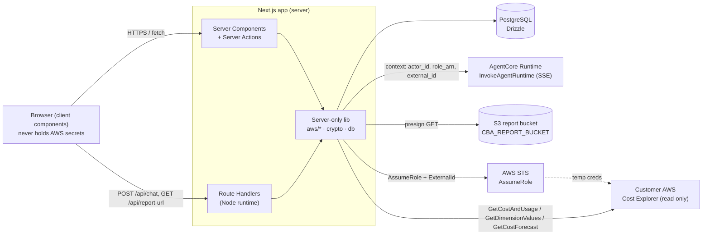

# Design Document

## Overview

Cloud Bill Analyst (Web) is a Next.js App Router (TypeScript) application in `app/`
that is the conversational front end to an already-deployed AWS Bedrock AgentCore
runtime (the Python agent in `agent/`, treated here as an external service defined
solely by `agent/AGENTCORE_INTEGRATION.md`). A signed-in user connects one or more
AWS accounts read-only, chats with the agent to analyze spend, watches a live
"what the agent is doing" activity timeline, sees cost-anomaly flags, and downloads
polished PDF/XLSX reports.

The whole design turns on one hard boundary: **the agent and all AWS SDK calls are
invoked server-side only, and per-account secrets (`role_arn`, `external_id`) are
resolved server-side and never sent to the browser.** Everything below is organized
around keeping that boundary intact while delivering a premium, editorial, streamed
chat experience.

### Design goals

- **Secret containment.** `role_arn`, decrypted `external_id`, and AWS credentials
  never appear in any HTTP response, SSE payload, or serialized data reaching the
  browser. Secrets live in server-only modules (`lib/aws/*`, `lib/crypto.ts`) that
  are never imported by client components.
- **Prompt streaming.** The `/api/chat` route runs on the Node runtime, relays the
  AgentCore SSE stream with buffering disabled, and flushes each event to the
  browser promptly (<1s), filtering to the known event vocabulary.
- **Session continuity.** Each chat thread is pinned to exactly one connected
  account and mapped one-to-one to a stable 33–128 char `runtimeSessionId`, so the
  agent's memory follows the conversation.
- **Read-only, key-free onboarding.** Accounts are connected via a generated
  CloudFormation template that provisions a read-only cross-account role trusted by
  `CBA_RUNTIME_ROLE_ARN` under an `sts:ExternalId` condition. No AWS access keys are
  ever collected.
- **Editorial polish + accessibility.** The "Sera" shadcn (Base UI) preset drives
  the visual language (Noto Serif headings, Lora body, Violet accent, Zinc
  neutrals, zero radius, HugeIcons, flat surfaces), with full keyboard support,
  `prefers-reduced-motion` handling, and `aria-live` streaming announcements.

### Key technology decisions

| Concern | Decision | Rationale |
|---|---|---|
| Framework | Next.js App Router + TypeScript | Server routes + server components keep secrets server-side; route handlers stream SSE. |
| Persistence | PostgreSQL + Drizzle ORM | Typed schema, generated migrations, Auth.js Drizzle adapter. |
| Auth | Auth.js credentials + argon2, DB-backed sessions | Email/password MVP; sessions in Postgres so `actor_id` is a stable app user id. |
| UI | shadcn (Base UI, "Sera" preset) | Matches design-system steering; sharp/serif/flat editorial look. |
| AWS | AWS SDK v3 (`bedrock-agentcore`, `s3`, `s3-request-presigner`, `sts`) | Server-only invocation, presign, and connection testing. |
| Validation | zod | Every route input validated before any AWS/DB/secret access. |
| Package manager | pnpm | Per tech steering. |

### External service contract (agent runtime)

The app depends on `InvokeAgentRuntime` (`@aws-sdk/client-bedrock-agentcore`) with
`accept: text/event-stream`. The request payload carries `prompt` plus a `context`
object (`actor_id`, `role_arn`, `external_id`, `account_alias`, `display_currency`,
`timezone`). The response is a stream of `data: <json>\n\n` SSE lines with event
types `delta`, `tool` (`phase` `start`/`end`), `report_file`, `error`, `done`.
Tool `name`s are `get_cost_and_usage`, `get_exchange_rate`, `create_chart`,
`create_report`. Unknown event types are ignored gracefully. The runtime ARN is
read from `process.env.CBA_RUNTIME_ARN`; it is never hardcoded.

## Architecture

### System context



The browser talks only to the Next.js server. All AWS interactions (`InvokeAgentRuntime`,
S3 presign, STS `AssumeRole`, Cost Explorer queries) happen inside server-only
modules. Secrets flow **into** the agent context server-side and never flow back
out to the browser.

### Runtime boundary (client vs server)

- **Client components** (`"use client"`): auth forms, chat UI (message list,
  activity timeline, report card, composer, suggestions, confirmation gate),
  account switcher, thread list, theme toggle, dashboard widgets. They call server
  routes/actions and consume the SSE stream. They import no `lib/aws/*` or
  `lib/crypto.ts`.
- **Server components / server actions**: page shells, guarded layouts, data reads
  (threads, messages, accounts listing with secrets stripped), feedback/settings
  mutations.
- **Route handlers** (`export const runtime = "nodejs"`): `/api/chat` (SSE relay),
  `/api/report-url`, `/api/accounts` + `/api/accounts/test`, `/api/auth/[...nextauth]`.
- **Server-only lib**: `lib/aws/agentcore.ts`, `lib/aws/s3.ts`, `lib/aws/sts.ts`,
  `lib/aws/cost-explorer.ts`, `lib/anomaly.ts`, `lib/crypto.ts`, `lib/session-id.ts`,
  `lib/cfn-template.ts`, `lib/redact.ts`, `lib/db/*`, `lib/auth.ts`, `lib/validation/*`.

Server-only modules import Node's `server-only` package so an accidental client
import fails the build (defense for Requirements 18.1, 5.9, 7.4).

### Route map (App Router)

```
app/
  (auth)/login/  register/                 # public
  (app)/                                   # guarded shell (redirect to /login if unauthenticated)
    dashboard/                             # spend overview + anomaly flags + accounts
    chat/[threadId]/                       # agentic chat (composer disabled w/o account)
    accounts/                              # connect/manage wizard + per-account settings
  api/
    chat/route.ts                          # POST: SSE relay -> AgentCore (Node runtime)
    report-url/route.ts                    # GET: presign an S3 report key
    accounts/route.ts                      # POST create / GET list
    accounts/test/route.ts                 # POST test connection (STS + tiny CE query)
    auth/[...nextauth]/route.ts            # Auth.js
```

### Chat request / SSE relay flow

```mermaid
sequenceDiagram
  participant B as Browser (useAgentStream)
  participant R as /api/chat (Node runtime)
  participant DB as Postgres
  participant A as AgentCore Runtime

  B->>R: POST {threadId, prompt} (session cookie)
  R->>R: assert authenticated session (else 401, no invoke)
  R->>DB: load Thread (owner check) + pinned ConnectedAccount
  alt no session / no pinned account / zero accounts
    R-->>B: typed error (no invoke)
  else ok
    R->>DB: read role_arn + encrypted external_id
    R->>R: decrypt external_id; assert CBA_RUNTIME_ARN set
    R->>A: InvokeAgentRuntime(accept=text/event-stream,<br/>runtimeSessionId, context{actor_id, role_arn, external_id, currency, tz, alias})
    loop each upstream SSE event
      A-->>R: data: {type, ...}
      R->>R: filter to known types; redact; flush <1s
      R-->>B: data: {type, ...} (no role_arn/external_id)
    end
    A-->>R: done | error
    R-->>B: done | error, then close
  end
```

The relay keeps the stream open until a `done` or `error` event is forwarded, or
until 120s elapse with no new upstream event. Unknown event types are dropped and
processing continues. Every outgoing chunk passes through a redaction guard.

### Account connection (onboarding) flow

```mermaid
sequenceDiagram
  participant U as User (browser)
  participant W as Account Wizard (server)
  participant STS as AWS STS
  participant CE as Customer Cost Explorer

  U->>W: Start wizard
  W->>W: generate External_Id (16-1224 chars, unique)
  W-->>U: CFN template (inline + download) + Launch Stack link<br/>(3 read-only CE actions; trust = CBA_RUNTIME_ROLE_ARN; ExternalId condition)
  U->>U: run stack in own account -> gets role ARN
  U->>W: paste role ARN + alias; Test connection
  W->>W: validate ARN format + alias (zod) [else reject, no assume]
  W->>STS: AssumeRole(roleArn, ExternalId) [<=30s]
  STS-->>W: temp creds
  W->>CE: GetCostAndUsage (1 day, DAILY, single metric)
  alt both succeed <=30s
    W->>W: encrypt External_Id (APP_ENCRYPTION_KEY)
    W-->>U: store ConnectedAccount {alias, role_arn, enc external_id, IDR, Asia/Jakarta}
  else fail / timeout
    W-->>U: redacted error (no external_id/creds); store nothing
  end
```

### Cross-account trust alignment (decision)

Two code paths assume a connected account's read-only role: (1) the agent runtime
during a chat, and (2) the web app **directly** for the dashboard overview and anomaly
detection (Req 12, 13). The onboarding CloudFormation trusts **`CBA_RUNTIME_ROLE_ARN`**
(the AgentCore runtime execution role) as the sole principal under the `sts:ExternalId`
condition. To keep a single trust principal, **the web app performs its Cost Explorer
reads using that same runtime-execution-role identity**:

- In production, deploy the web app with an AWS identity that can assume
  `CBA_RUNTIME_ROLE_ARN`; `lib/aws/cost-explorer.ts` first obtains runtime-role
  credentials (role-chaining) and only then assumes the customer role with the
  account's External_Id. This makes the web app's assume-role caller match the CFN
  trust principal, so roles created by the wizard accept it.
- For local development, use the self-account test role (which trusts the account root
  your dev credentials belong to); real customer roles will not trust root.

Rejected alternatives: routing dashboard/anomaly reads through the agent (slower, and
the agent returns conversational output, not structured anomaly data), and broadening
the CFN trust to also list the web app's identity (two principals plus an extra env var
to inject the web-app role ARN at template-generation time).

### Data flow for secrets

`external_id` is generated in plaintext only transiently during the wizard, sent to
the browser only as part of the CFN template the user needs (it is the customer's
own trust condition value, not an app credential), then stored **encrypted** with
`APP_ENCRYPTION_KEY`. After storage, the decrypted `external_id` and the `role_arn`
are read server-side only for STS `AssumeRole` and for the agent `context`, and are
stripped from every browser-bound response by `lib/redact.ts`.

## Components and Interfaces

Interfaces below are the contracts each module exposes. Client-facing types never
carry `roleArn` or `externalId`.

### Server-only: AWS integration

#### `lib/aws/agentcore.ts`

```ts
import "server-only";

export interface AgentContext {
  actor_id: string;            // authenticated user id
  role_arn: string;            // secret (server-side only)
  external_id: string;         // secret, decrypted (server-side only)
  account_alias: string;
  display_currency: string;    // default "IDR"
  timezone: string;            // default "Asia/Jakarta"
}

export interface InvokeParams {
  prompt: string;
  sessionId: string;           // 33-128 chars, stable per thread
  context: AgentContext;
}

// Reads process.env.CBA_RUNTIME_ARN at call time; throws MissingRuntimeConfigError
// if unset/empty (Req 18.4). Returns the upstream async byte iterable (SSE).
export function invokeAgentRuntime(p: InvokeParams): Promise<AsyncIterable<Uint8Array>>;
```

#### `lib/aws/sse.ts` — SSE parsing, filtering, redaction (pure, testable)

```ts
export type SseEvent =
  | { type: "delta"; text: string }
  | { type: "tool"; phase: "start"; id: string; name: string; label: string; status: string }
  | { type: "tool"; phase: "end"; id: string; name: string }
  | { type: "report_file"; key: string; bucket: string }
  | { type: "error"; message: string }
  | { type: "done" };

const KNOWN = ["delta", "tool", "report_file", "error", "done"] as const;

// Splits a byte/string stream on \n\n, parses `data:` JSON lines.
export function parseSseChunk(buffer: string): { events: unknown[]; rest: string };

// Keeps only known event types (Req 7.7); returns null for unknown/malformed.
export function toKnownEvent(raw: unknown): SseEvent | null;

// Strips role_arn / external_id / AWS creds from any object graph before it is
// serialized to the browser (Req 7.4, 18.2). Idempotent.
export function redactForBrowser<T>(value: T): T;
```

#### `lib/aws/s3.ts` — report presign

```ts
import "server-only";

export interface PresignResult { url: string; fileType: "pdf" | "xlsx"; expiresIn: number; }

// Authorizes `key` via keyBelongsToActor (exact `<REPORT_PREFIX>/<actorId>/<file>`
// match, Req 11.3), then mints a presigned GET on CBA_REPORT_BUCKET with expiry in
// [1,300]s (Req 11.2).
export function presignReport(actorId: string, key: string): Promise<PresignResult>;

// Pure helper: derive "pdf" | "xlsx" from a report key (Req 11.6).
export function reportFileType(key: string): "pdf" | "xlsx" | null;

// Pure helper: true IFF `key` has the exact form `<REPORT_PREFIX><actorId>/<file>`,
// where REPORT_PREFIX = "cloud-bill-analyst/reports/" (matching the runtime's
// REPORT_PREFIX) and <actorId> is the path segment immediately after it. This is NOT
// a startsWith/contains check - the report prefix precedes the actor id in the key. (Req 11.3)
export function keyBelongsToActor(actorId: string, key: string): boolean;
```

#### `lib/aws/sts.ts` + `lib/aws/cost-explorer.ts`

```ts
import "server-only";

export interface AssumedCreds { accessKeyId: string; secretAccessKey: string; sessionToken: string; }

// AssumeRole with ExternalId, performed from the runtime-execution-role identity
// (see "Cross-account trust alignment"); used by connection test + Cost Explorer reads.
export function assumeReadOnlyRole(roleArn: string, externalId: string): Promise<AssumedCreds>;

export interface ConnectionTestResult { ok: boolean; category?: "assume_failed" | "query_failed" | "timeout"; }

// Assume + minimal 1-day DAILY single-metric GetCostAndUsage within 30s (Req 4.1, 4.3).
export function testConnection(roleArn: string, externalId: string): Promise<ConnectionTestResult>;

// Read-only Cost Explorer reads scoped to an assumed role (dashboard + anomalies).
export function getCostAndUsage(creds: AssumedCreds, input: CeQueryInput): Promise<CeResult>;
```

#### `lib/aws/cfn-template.ts` — CloudFormation generation (pure, testable)

```ts
// Generates the read-only role template: exactly ce:GetCostAndUsage,
// ce:GetDimensionValues, ce:GetCostForecast; trust principal = runtimeRoleArn;
// condition sts:ExternalId == externalId (Req 3.2). Returns YAML/JSON string.
export function buildCfnTemplate(runtimeRoleArn: string, externalId: string): string;

// Launch Stack console deep link referencing the template (Req 3.3).
export function launchStackUrl(templateUrl: string, region: string): string;
```

### Server-only: crypto, ids, anomalies, validation

#### `lib/crypto.ts`

```ts
import "server-only";
// AES-256-GCM using APP_ENCRYPTION_KEY. decrypt(encrypt(x)) === x (Req 4.4, 18.5).
export function encryptSecret(plaintext: string): string;   // base64(iv|tag|ct)
export function decryptSecret(ciphertext: string): string;
```

#### `lib/session-id.ts` (pure, testable)

```ts
// Deterministic, stable per thread; produces a 33-128 char id (Req 7.9, 8.3, 8.4).
export function sessionIdForThread(threadId: string): string;
// One-shot generator (used at thread creation) guaranteed length in [33,128].
export function newSessionId(): string;
```

#### `lib/external-id.ts` (pure, testable)

```ts
// Cryptographically random External_Id, length in [16,1224] (Req 3.1).
export function newExternalId(): string;
```

#### `lib/anomaly.ts` — anomaly classification (pure, testable)

```ts
export type AnomalyKind = "spike" | "new_service" | "large_mom_delta";
export interface Anomaly { service: string; kind: AnomalyKind; detail: Record<string, number>; }

export interface ServiceCostSeries {
  service: string;
  currentMonthCost: number;
  previousFullMonthCost: number;
  dailyCosts: number[];          // trailing days incl. latest
}

// Pure classifier (Req 13.1,13.4,13.5,13.6): each detected anomaly gets exactly one
// kind. spike: latest daily >= 1.5 * trailing-7-day avg. new_service: current>0 &&
// prev==0. large_mom_delta: (current-prev)/prev >= 0.25.
export function classifyAnomalies(series: ServiceCostSeries[]): Anomaly[];
```

#### `lib/validation/*` (zod schemas, pure)

```ts
export const emailSchema = /* trimmed, <=254 chars, RFC-ish local@domain */;
export const passwordSchema = /* length 8..128 */;
export const roleArnSchema = /* arn:aws:iam::<12-digit>:role/<name> */;
export const aliasSchema = /* trimmed length 1..100 */;
export const currencySchema = /* ISO 4217 3-letter */;
export const timezoneSchema = /* valid IANA tz (Intl.supportedValuesOf/DateTimeFormat) */;

export function normalizeEmail(raw: string): string;              // trim + lowercase (Req 1.2)
export function maskAccountId(accountId12: string): string;        // reveal last 4 (Req 5.3)
export function accountIdFromRoleArn(roleArn: string): string;     // extract 12-digit id
```

### Client: chat stream hook and UI

#### `hooks/useAgentStream.ts` — SSE → UI state (pure reducer, testable)

The event parsing and state reduction are isolated in a pure reducer so they can be
property-tested independently of the network.

```ts
export interface ActivityStep {
  id: string; name: string; label: string; status: string;
  state: "running" | "done" | "stopped";       // spinner | check | stopped
}
export interface StreamState {
  assistantText: string;                         // accumulated delta text
  steps: ActivityStep[];                         // in received order
  reports: { key: string }[];                    // report_file events (card shown after presign)
  phase: "idle" | "streaming" | "done" | "error";
  collapsed: boolean;                            // timeline collapsed after done
  errorMessage?: string;
  liveRegion: string;                            // aria-live text (Req 9.8, 20.7)
}

export type StreamAction = { kind: "event"; event: SseEvent } | { kind: "reset" };

// Pure reducer implementing Req 9 (timeline) + Req 10.1/10.7 (delta append).
export function streamReducer(s: StreamState, a: StreamAction): StreamState;

// Hook wires fetch("/api/chat") + streamReducer; exposes state + send().
export function useAgentStream(threadId: string): {
  state: StreamState;
  send: (prompt: string) => Promise<void>;
};
```

Reducer rules (map directly to Requirement 9/10):
- `tool start` new `id` → append step `running`; existing `id` → update `label`/`status` in place, no duplicate.
- `tool end` matching `id` → set that step `done`; non-matching `id` → ignore.
- `delta` → append `text` to `assistantText` in order; malformed markdown never discards prior text.
- `report_file` → record key (card rendered only after `/api/report-url` returns).
- `done` → `phase=done`, `collapsed=true`, summary = ordered concat of step `status`/`label`.
- `error` → `phase=error`; every `running` step becomes `stopped` (spinner cleared, not checked).
- unknown event → ignored (filtered upstream, defensively ignored here too).

#### Chat presentational components (`components/chat/`)

- `AgentIntro` — empty state: name, model badge, capability list, connected-account chip (design-system §1).
- `MessageList` — right-aligned user bubbles (zinc), left-aligned assistant prose; GitHub-flavored markdown with tables + inline code chips (Req 10.2, 10.4, 10.5). Uses Base UI `Message Scroller` for anchored auto-scroll (Req 10.3, 10.6).
- `ActivityTimeline` — renders `StreamState.steps`; HugeIcon + status + label badge; spinner/check/stopped; collapse/expand on `done`; `aria-live="polite"` region (Req 9).
- `ReportCard` — file-type icon (PDF/XLSX), filename, Download; rendered only once presigned URL resolves (Req 11.5, 11.6).
- `AnomalyCallout` — inline rose (spike) / amber (new service, large MoM) callout (Req 13.3).
- `MessageActions` — copy, regenerate, thumbs up/down (Req 14).
- `Suggestions` — 3–6 variative prompt chips (Req 16).
- `ConfirmationGate` — inline approve/reject prompt (Req 15).
- `Composer` — text input + attach affordance + circular send; disabled state with connect-account CTA when zero accounts (Req 6, design-system §9).

#### `lib/suggestions.ts` (pure, testable)

```ts
// Produces 3-6 chips (1..120 chars each). Given the previous render's chips for the
// same thread, ensures >= half differ in wording (Req 16.1, 16.3). Returns [] when
// fewer than 3 valid chips are available (Req 16.4).
export function generateSuggestions(ctx: SuggestionCtx, previous: string[]): string[];
```

### Server actions (mutations)

- `registerUser(input)` — validate (email/password), normalize email, reject duplicate, argon2-hash, create user + session (Req 1).
- `createConnectedAccount` / `deleteConnectedAccount` / `updateAccountSettings` — Req 4, 5, 17.
- `setActiveAccount(accountId)` — persists active selection across sessions (Req 5.5).
- `createThread({ connectedAccountId })` — pin account, generate & persist sessionId (Req 8).
- `setMessageFeedback(messageId, value | null)` — persist/replace/remove feedback (Req 14.5, 14.6).

## Data Models

A single Drizzle `schema.ts` defines all tables; SQL migrations are generated with
`drizzle-kit` (never hand-edited). Auth.js uses the Drizzle adapter.

### Entity relationships

```mermaid
erDiagram
  USER ||--o{ SESSION : has
  USER ||--o{ CONNECTED_ACCOUNT : owns
  USER ||--o{ THREAD : owns
  USER ||--o| ACTIVE_ACCOUNT : selects
  CONNECTED_ACCOUNT ||--o{ THREAD : "pinned to"
  THREAD ||--o{ MESSAGE : contains
  MESSAGE ||--o| MESSAGE_FEEDBACK : rated
  USER ||--o{ LOGIN_ATTEMPT : throttled_by

  USER { text id PK; text email UK; text email_normalized UK; text password_hash; timestamptz created_at }
  SESSION { text session_token PK; text user_id FK; timestamptz expires }
  CONNECTED_ACCOUNT { text id PK; text user_id FK; text alias; text role_arn; text external_id_enc; text aws_account_id; text display_currency; text timezone; timestamptz created_at }
  ACTIVE_ACCOUNT { text user_id PK; text connected_account_id FK }
  THREAD { text id PK; text user_id FK; text connected_account_id FK; text session_id UK; text title; timestamptz created_at }
  MESSAGE { text id PK; text thread_id FK; text role; text content; timestamptz created_at }
  MESSAGE_FEEDBACK { text message_id PK; text value }
  LOGIN_ATTEMPT { text id PK; text email_normalized; boolean success; timestamptz created_at }
```

### Tables

**`users`** (Req 1, 2.6)
- `id` text PK (used as `actor_id`).
- `email` text — stored as entered.
- `email_normalized` text UNIQUE — `trim().toLowerCase()`, enforces case-insensitive uniqueness (Req 1.2).
- `password_hash` text — argon2 hash only; plaintext never stored (Req 1.5, 5).
- `created_at` timestamptz.

**`sessions`** (Auth.js Drizzle adapter; Req 2)
- `session_token` PK, `user_id` FK, `expires` timestamptz.
- 30-day max lifetime enforced via `expires` at creation; expired rows deleted and treated as unauthenticated (Req 2.7, 2.8).
- Credentials provider note: Auth.js defaults credentials to JWT sessions. To satisfy DB-backed sessions (Req 1.6, 2.1), the design uses a database session strategy with a custom credentials authorize flow that creates a `sessions` row on successful login/registration and deletes it on sign-out (Req 2.5).

**`connected_accounts`** (Req 4, 5, 17)
- `id`, `user_id` FK.
- `alias` text (1–100 chars trimmed).
- `role_arn` text — secret; never serialized to browser.
- `external_id_enc` text — AES-256-GCM ciphertext of External_Id (Req 4.4, 18.5). Plaintext never stored.
- `aws_account_id` text — 12-digit id extracted from `role_arn`, used for masked display (Req 5.3).
- `display_currency` text default `IDR`; `timezone` text default `Asia/Jakarta` (Req 4.4, 17).
- Per-user count constrained to 1–10 at the application layer (Req 5.1, 5.2).

**`active_account`** (Req 5.5, 5.7)
- `user_id` PK, `connected_account_id` FK nullable. Persists the active selection across sessions; cleared when the active account is removed.

**`threads`** (Req 8)
- `id`, `user_id` FK, `connected_account_id` FK (pinned at creation, immutable).
- `session_id` text UNIQUE — 33–128 chars, one-to-one with the thread, never reassigned (Req 8.3, 8.4, 7.9).
- `title`, `created_at`.

**`messages`** (Req 8.5, 10)
- `id`, `thread_id` FK, `role` (`user` | `assistant`), `content` text, `created_at` timestamptz.
- Displayed ordered by `created_at` ascending (Req 8.5).

**`message_feedback`** (Req 14.5–14.8)
- `message_id` PK (one row per message max), `value` (`up` | `down`). Absence = no-feedback state; setting replaces; toggling the current value deletes the row.

**`login_attempts`** (Req 2.9)
- `id`, `email_normalized`, `success` boolean, `created_at`. Failed attempts in the trailing 15-minute window are counted; ≥5 failures locks that email for 15 minutes.

### Derived / non-persisted types

- `ConnectedAccountView` — the browser-safe projection: `{ id, alias, maskedAccountId, displayCurrency, timezone }`. Excludes `role_arn` and `external_id_enc` (Req 5.9, 18.2).
- `SseEvent`, `StreamState`, `ActivityStep` — transient client state (see Components).
- `Anomaly` — computed per request, not persisted.

### Environment configuration (Req 19)

Read server-side only at request time: `DATABASE_URL`, `AUTH_SECRET`,
`APP_ENCRYPTION_KEY`, `AWS_REGION`, `CBA_RUNTIME_ARN`, `CBA_RUNTIME_ROLE_ARN`,
`CBA_REPORT_BUCKET`. `.env.example` is committed with exactly one non-secret
placeholder per variable; real values live only in the git-ignored `.env`. A missing
required variable yields a server error plus exactly one log entry naming the
variable, with no values logged (Req 19.5).

## Correctness Properties

*A property is a characteristic or behavior that should hold true across all valid
executions of a system — essentially, a formal statement about what the system
should do. Properties serve as the bridge between human-readable specifications and
machine-verifiable correctness guarantees.*

These property-based tests apply to the **pure-logic core** of this app: SSE
parsing, the activity-timeline/delta reducer, secret redaction and encryption, id
generation, input validation, account masking, anomaly classification, suggestion
generation, and the feedback/confirmation-gate state machines. Auth flows, CRUD, AWS
integration, UI rendering, theming, and accessibility are covered by
example/integration/snapshot tests instead (see Testing Strategy). Each property
below reflects the prework classification and consolidates the redundancies noted in
the property reflection.

### Property 1: Password hash verification round-trip

*For any* password string of length 8–128, hashing it with argon2 and then verifying
the same password against that hash SHALL succeed, and verifying any different
password against that hash SHALL fail.

**Validates: Requirements 1.1, 1.5**

### Property 2: Email normalization equivalence

*For any* email string, `normalizeEmail` SHALL be idempotent, and any two emails that
differ only by surrounding whitespace or letter case SHALL normalize to the same
value (so duplicate detection is case-insensitive and trim-insensitive).

**Validates: Requirements 1.2**

### Property 3: Email validation

*For any* string, the email schema SHALL accept it if and only if it is non-empty, at
most 254 characters, and matches the `local-part@domain` form.

**Validates: Requirements 1.3**

### Property 4: Password length validation

*For any* string, the password schema SHALL accept it if and only if its length is in
the inclusive range 8 to 128.

**Validates: Requirements 1.4**

### Property 5: Login rate-limit lockout

*For any* sequence of failed login attempts with timestamps for a single normalized
email, the account SHALL be locked at time `now` if and only if at least 5 failures
fall within the trailing 15-minute window `[now − 15min, now]`.

**Validates: Requirements 2.9**

### Property 6: External_Id generation bounds and uniqueness

*For any* number of generated External_Ids, each SHALL have length in the inclusive
range 16 to 1224, and all generated values SHALL be distinct.

**Validates: Requirements 3.1**

### Property 7: CloudFormation template correctness

*For any* runtime role ARN and generated External_Id, the produced CloudFormation
template SHALL grant exactly the three actions `ce:GetCostAndUsage`,
`ce:GetDimensionValues`, and `ce:GetCostForecast` and no others, SHALL set the trust
principal to that runtime role ARN, and SHALL set a trust condition requiring
`sts:ExternalId` to equal that External_Id.

**Validates: Requirements 3.2**

### Property 8: Account alias validation

*For any* string, the alias schema SHALL accept it if and only if its length after
trimming leading and trailing whitespace is in the inclusive range 1 to 100.

**Validates: Requirements 3.4, 3.7**

### Property 9: Role ARN validation

*For any* string, the role ARN schema SHALL accept it if and only if it matches the
IAM role ARN form `arn:aws:iam::<12-digit account>:role/<name>`.

**Validates: Requirements 3.6**

### Property 10: Connection test rejects invalid input before any assume-role

*For any* input whose role ARN is malformed or whose alias is empty or exceeds 100
characters, `testConnection` SHALL reject the request and SHALL perform zero STS
`AssumeRole` calls.

**Validates: Requirements 4.2**

### Property 11: External_Id encryption round-trip

*For any* External_Id string, `decryptSecret(encryptSecret(x))` SHALL equal `x`, and
the ciphertext SHALL differ from the plaintext.

**Validates: Requirements 4.4, 4.6, 18.5**

### Property 12: Secret redaction for all browser-bound output

*For any* object graph destined for the browser — including account listing,
switcher, and detail projections, and every relayed SSE event (`delta`, `tool`,
`report_file`, `error`, `done`) — the redaction guard SHALL produce output that
contains no `role_arn`, no decrypted External_Id, and no AWS access key, secret key,
or session token; and the guard SHALL be idempotent.

**Validates: Requirements 4.5, 4.6, 5.9, 7.4, 18.2**

### Property 13: Connected-account count bound

*For any* current connected-account count `c` for a user, storing a new account SHALL
be permitted if and only if `c < 10`; when `c` equals 10 the store SHALL be rejected
and the existing accounts SHALL remain unchanged.

**Validates: Requirements 5.1, 5.2**

### Property 14: Account-id masking

*For any* 12-digit AWS account id, `maskAccountId` SHALL reveal exactly the last 4
digits, replace each of the preceding 8 digits with a masking character, and preserve
the total length.

**Validates: Requirements 5.3**

### Property 15: Composer enablement

*For any* connected-account count, the chat composer SHALL be enabled if and only if
the count is greater than zero.

**Validates: Requirements 6.1, 6.2, 6.3, 6.4**

### Property 16: SSE relay filtering and ordering

*For any* sequence of upstream SSE events mixing known types (`delta`, `tool`,
`report_file`, `error`, `done`) with unknown types, the relay SHALL forward exactly
the known events, in their original received order, and SHALL drop every unknown
event.

**Validates: Requirements 7.6, 7.7**

### Property 17: Runtime session id generation

*For any* thread id, `sessionIdForThread` SHALL return a value whose length is in the
inclusive range 33 to 128, SHALL return the identical value on repeated calls for the
same thread id, and SHALL return distinct values for distinct thread ids.

**Validates: Requirements 7.9, 8.3, 8.4**

### Property 18: Currency and timezone resolution with defaults

*For any* connected-account settings, the resolved invocation `display_currency` and
`timezone` SHALL equal the account's set values, substituting `IDR` for an unset
currency and `Asia/Jakarta` for an unset timezone.

**Validates: Requirements 7.5, 17.5**

### Property 19: Message ordering

*For any* set of messages in a thread, the rendered message order SHALL be
non-decreasing by creation timestamp (oldest first).

**Validates: Requirements 8.5**

### Property 20: Activity-timeline step invariants

*For any* sequence of `tool` events, the resulting timeline SHALL contain exactly one
step per distinct `start` `id`; each step SHALL be marked complete if and only if a
`tool end` event with the matching `id` was received after its `start`; a `tool end`
whose `id` matches no started step SHALL leave all steps unchanged; a step that has a
`start` and no matching `end` SHALL be shown running (spinner, no check-mark); and
after an `error` event every still-running step SHALL become stopped and never shown
as complete.

**Validates: Requirements 9.1, 9.2, 9.3, 9.4, 9.5, 9.7**

### Property 21: Done-summary ordering

*For any* sequence of `tool` events followed by a `done` event, the collapsed summary
SHALL be the concatenation of each step's `status` (or `label`) in received order,
and re-expanding SHALL restore the full ordered step list.

**Validates: Requirements 9.6**

### Property 22: Delta accumulation preserves content and order

*For any* sequence of `delta` events, the accumulated assistant text SHALL equal the
in-order concatenation of their `text` values, and no previously appended text SHALL
be discarded even when a `delta` contains malformed or incomplete markdown.

**Validates: Requirements 10.1, 10.7**

### Property 23: Report key authorization

*For any* actor id and report key, presigning SHALL proceed if and only if the key has
the exact form `cloud-bill-analyst/reports/<actorId>/<filename>` - i.e. the actor id is
the path segment immediately following the fixed `cloud-bill-analyst/reports/` prefix (a
leading-substring or "contains" check is insufficient, since the report prefix precedes
the actor id); on any other key no presigned URL SHALL be minted or returned.

**Validates: Requirements 11.3**

### Property 24: Report file-type indicator

*For any* report key, `reportFileType` SHALL return `pdf` when the key denotes a PDF
object and `xlsx` when the key denotes an XLSX object.

**Validates: Requirements 11.6**

### Property 25: Anomaly classification

*For any* set of per-service cost series, the classifier SHALL flag a service as a
`spike` if and only if its latest single-day cost is at least 1.5 times its trailing
7-day average daily cost, as a `new_service` if and only if its current-month cost is
greater than zero and its immediately preceding full-month cost is zero, and as a
`large_mom_delta` if and only if the month-over-month increase versus the immediately
preceding full month is at least 25 percent; and each detected anomaly SHALL carry
exactly one classification.

**Validates: Requirements 13.1, 13.4, 13.5, 13.6**

### Property 26: Message-feedback state machine

*For any* sequence of thumbs-up/thumbs-down activations on a message, at most one
feedback value SHALL be stored at any time; submitting a value SHALL replace any prior
value; activating the control matching the currently stored value SHALL return the
message to the no-feedback state; and the displayed state SHALL reflect the stored
value.

**Validates: Requirements 14.5, 14.6, 14.8**

### Property 27: Confirmation-gate state machine

*For any* sequence of confirmation-gate interactions for a pending action, the
Agent_Runtime SHALL be invoked exactly once if and only if the user issues exactly
one approve for that action, and SHALL be invoked zero times otherwise; while the
prompt is unanswered the action SHALL remain blocked and SHALL not be invoked.

**Validates: Requirements 15.1, 15.2, 15.3, 15.4, 15.5**

### Property 28: Suggestion chip bounds

*For any* suggestion context in which at least three valid chips are available,
`generateSuggestions` SHALL return between 3 and 6 chips, each containing between 1
and 120 characters of text.

**Validates: Requirements 16.1**

### Property 29: Suggestion variability

*For any* previous render's chip set for a thread, at least half of the chips
presented on the next render for that thread SHALL differ in wording from the previous
render's chips.

**Validates: Requirements 16.3**

### Property 30: Currency and timezone validation

*For any* string, the currency schema SHALL accept it if and only if it is a valid
ISO 4217 three-letter code, and the timezone schema SHALL accept it if and only if it
is a valid IANA time-zone identifier; a rejected update SHALL leave the previously
persisted value unchanged.

**Validates: Requirements 17.2, 17.3**

### Property 31: Input validation gates side effects

*For any* route input that fails its zod schema, the route SHALL return a typed,
field-scoped validation error that echoes no secret value and SHALL perform zero AWS
SDK calls, zero database writes, and zero secret reads.

**Validates: Requirements 18.6, 18.7**

## Error Handling

Errors are handled at the boundary they occur, always redacting secrets and always
returning typed results the UI can render.

### Validation errors (zod)

Every route handler and server action parses input with a zod schema before any AWS
call, DB write, or secret access (Req 18.6). On failure it returns a typed
`{ error: { field, code, message } }` with HTTP 400, echoing no secret values
(Req 18.7). Field-specific messages identify the offending field for auth and wizard
forms (Req 1.3, 1.4, 2.3, 3.6, 3.7, 4.2, 17.3).

### Authentication / authorization errors

- Unauthenticated request to a guarded route → redirect to `/login` (Req 2.4).
- Invalid credentials → generic "credentials are invalid" message, no session, email
  retained (Req 2.2); missing field → missing-field message (Req 2.3).
- Rate-limited email → "too many failed attempts" for 15 minutes (Req 2.9).
- Chat/report/thread request without a valid session → reject with no invocation and
  no SSE output (Req 7.10); report key whose actor prefix mismatches → authorization
  error, no presign (Req 11.3); non-owned thread → access denied (Req 8.7).

### AWS integration errors

- **Missing runtime config:** if `CBA_RUNTIME_ARN` is unset/empty at invoke time,
  throw a typed `MissingRuntimeConfigError`, make no SDK call, and surface a
  server-side configuration error (Req 18.4, 19.5).
- **Invoke start failure:** the relay emits exactly one `error` SSE event whose
  message contains no `role_arn`, `external_id`, AWS credentials, or runtime ARN, then
  closes the stream (Req 7.8).
- **Mid-stream upstream `error` event:** forwarded as-is (already redacted by the
  runtime) and additionally passed through `redactForBrowser`; open timeline steps
  become `stopped` (Req 9.7).
- **Stream stall:** if 120s elapse with no new upstream event, the relay closes the
  stream (Req 7.6).
- **Connection test failure/timeout:** return a redacted error categorized as
  `assume_failed | query_failed | timeout`, storing nothing and leaving prior accounts
  unchanged (Req 4.3, 4.5).
- **Presign failure / missing key or bucket:** return a presign error; never return a
  partial or malformed URL, and never render a report card (Req 11.4, 11.5).
- **Cost Explorer failure/timeout (dashboard):** show a redacted error state with a
  retry control (Req 12.6).
- **Cost Explorer failure (anomalies):** return zero anomalies; render no badges or
  callouts (Req 13.7).

### Client rendering errors

- **Malformed markdown** in a `delta`: render accumulated text without discarding
  prior content and without surfacing an unhandled error (Req 10.7).
- **Clipboard write failure**: show a copy-failed indication; message content
  unchanged (Req 14.2).
- **Feedback persistence failure**: retain the prior feedback state and show an error
  (Req 14.7).
- **Unknown SSE event type**: ignored; processing continues (Req 7.7, 9.4).

### Environment errors

A missing required environment variable, when a dependent route runs, returns a
server error and records exactly one log entry naming the variable, with no variable
values in the response or log (Req 19.5).

## Testing Strategy

### Dual approach

- **Property-based tests** verify the universal properties above across many
  generated inputs. They target the pure-logic core and run without network or DB.
- **Unit / example tests** cover concrete scenarios, UI mappings, and error paths.
- **Integration tests** (mocked AWS clients) cover invocation wiring, presign, STS,
  and Cost Explorer flows.
- **Snapshot / accessibility tests** cover markdown rendering, the Sera design
  tokens, theming, and keyboard/contrast checks.

### Property-based testing

- Library: **fast-check** with the test runner (Vitest). Do not hand-roll generators
  for randomization — use fast-check arbitraries.
- Each property test runs a **minimum of 100 iterations**.
- Each property test is tagged with a comment referencing its design property:
  `// Feature: cloud-bill-analyst-web, Property {number}: {property_text}`.
- Each of the 31 correctness properties is implemented by a **single** property-based
  test.

Focused generators:
- passwords (length-bounded strings), emails (valid + malformed), role ARNs,
  aliases, ISO 4217 currencies + junk, IANA timezones + junk.
- SSE event sequences: arbitrary interleavings of `delta`, `tool start/end` (with a
  pool of ids, some matched some not), `report_file`, `error`, `done`, and injected
  unknown types — used for Properties 12, 16, 20, 21, 22.
- per-service cost series (current/previous month + trailing daily arrays) spanning
  spike/new-service/large-delta boundaries — used for Property 25.
- feedback and confirmation-gate action sequences — Properties 26, 27.
- 12-digit account ids, report keys with pdf/xlsx suffixes and actor prefixes —
  Properties 14, 23, 24.

### Unit / example tests

Auth messages and retention (2.2, 2.3), template presentation and Launch Stack link
(3.3), no-keys schema (3.5), happy-path store with defaults (4.4), account CRUD and
active-selection transitions (5.4–5.8), chat guards (6.5, 7.10, 7.11), thread pin /
ownership / empty-thread (8.1, 8.2, 8.6, 8.7, 8.9), aria-live updates (9.8, 20.7),
message alignment (10.4, 10.5), copy/regenerate flows (14.1–14.4), chip interaction
and fallback (16.2, 16.4), settings display and env errors (17.1, 18.4, 19.4, 19.5).

### Integration tests (mocked AWS)

Invocation wiring and accept/ARN/context (7.1, 7.2, 7.3), invoke-start error event
(7.8), connection test happy path and timeout (4.1, 4.3), presign (11.1, 11.2, 11.4),
dashboard CE states (12.1–12.6), session creation/deletion/lifetime (1.6, 2.1, 2.5,
2.7, 2.8).

### Snapshot / accessibility / static tests

Markdown table + code-chip rendering (10.2), Sera tokens — serif headings, Lora body,
Violet accent, Zinc neutrals, 0 radius, flat surfaces, HugeIcons (20.1, 20.8), theme
light/dark + OS preference + persistence (20.2, 20.3), reduced motion (20.4), keyboard
traversal/activation/focus (20.5), contrast via automated axe checks in both themes
(20.6), anomaly badge/callout accent mapping (13.2, 13.3). Static checks: server-only
imports (18.1), no runtime-ARN literal in source (18.3), `.env.example` has exactly
the seven placeholders (19.2), `.env` git-ignored (19.3).

> Accessibility note: automated checks cover structure, focus, ARIA, and contrast
> computation, but full WCAG compliance additionally requires manual testing with
> assistive technologies and expert review.
